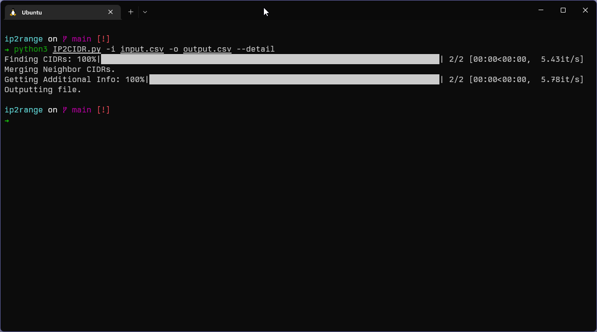

# IP -> CIDR

This script will convert a csv list of IP addresses into their respective CIDR subnets with the owner names.

## Input Example

|       IP       |
|:--------------:|
|    8.8.8.8     |
| 208.67.222.222 |

This can also be found in the input.csv file

## Output Example

### Regular

|      CIDR       |
|:---------------:|
|    8.0.0.0/9    |
| 208.67.216.0/21 |

### Detailed

|      CIDR       |       Owner        | Country |
|:---------------:|:------------------:|:-------:|
|    8.0.0.0/9    | Level 3 Parent LLC |   US    |
| 208.67.216.0/21 | Cisco OpenDNS LLC  |   US    |

This can also be found in the output.csv file

## Requirements

- Python3
- ipwhois
- tqdm
- netaddr
- ipaddress

## Usage & "Installation"

```
sudo apt install python3
pip3 install ipwhois tqdm netaddr ipaddress

git clone https://github.com/RustedAperture/IP2RANGE
cd IP2RANGE
Python3 IP2CIDR.py -i <input_file> -o <output_file>
```

By adding the `--detail` option it will add the country and owner to the CSV

## Screenshot
