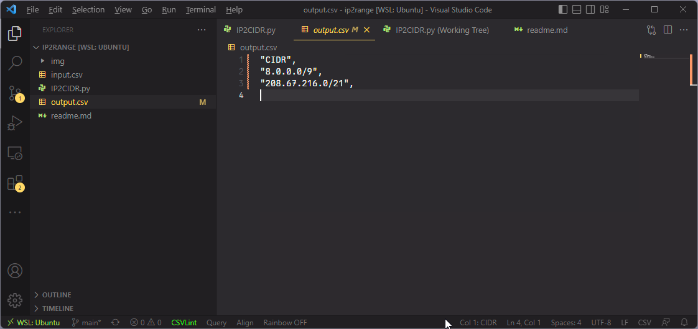

# IP -> CIDR

This script will convert a csv list of IP addresses into their respective CIDR subnets with the owner names.

## Screenshots

### Input Example

### Output Example
#### Regular

#### Detailed


## Requirements

- Python3
- ipwhois
- tqdm
- netaddr
- ipaddress

## Usage & "Installation"

Instructions for Ubuntu
```
sudo apt install python3 python3-pip
pip3 install ipwhois tqdm netaddr ipaddress

git clone https://github.com/RustedAperture/IP2RANGE
cd IP2RANGE
Python3 IP2CIDR.py -i <input_file> -o <output_file> --detail
```

By adding the `--detail` option it will add the country and owner to the CSV
